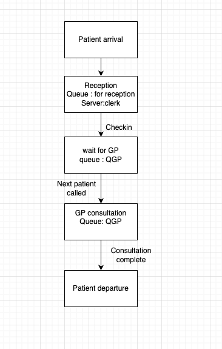

# Task 1 
1. **Using an example case (health centre, bank, etc.), discuss the meaning and characterisation of all the performance 
measures discussed in the lesson material using the concepts of the target system.**

In Health center:
- **Queue Length** : How long a patient wait before being served.
- **Queue Time** : Time which patient spends waiting before served.
- **Service Time** : The time a medical professional (e.g., doctor, nurse) spends treating a patient.
- **System time** : The total time a patient spends in the centre: Queueing Time + Service Time.
- **idle time** : Time not serving anyone
- **Utilisation** : Percentage of time a doctor/reception is busy
- **Throughput** : The total number of patients processed by the system or a specific service point within the simulation time.

2. **Consider the categories in which performance measures are maintained/updated/computed. (Think in general terms: 
service point/customer; not in target system terms.)**

Let's take an example of Health Center. Here Patients are arriving for different purpose and service-point is
Reception i.e doctor 1, nurse 1, or doctor2.

3. **Design two different systems of three or four service points for a real-world destination. Use real-world concepts. 
Draw diagrams using the graphical representation of a service point shown in section ´Performance Variables´.**

For Health center:

4. **Write an algorithm in Java or pseudocode for the main loop of the simulator: The main loop does all the things 
required for a three-phase simulation (presented in a section). Think in general terms (don't think in detail) and present
a general solution. No need for target system concepts.**

**Construction phase**
- Initialize simulation clock (Time = 0)
- Initialize all service points (queues, servers, stats)
- Schedule the first initial event (e.g., first customer arrival) into the Future Event List

Main simulation loop:
**Phase A**
- Find next event (smallest timestamp in event list)
Event nextEvent = eventList.removeNext();
clock.setTime(nextEvent.getTime());

**phase B**
- Execute the routine for the event type we just removed
- create new customer, put in queue
SWITCH (NextEvent.Type):
CASE "Arrival":
Execute_Arrival_Event_Routine(NextEvent.Customer)
CASE "End-of-Service":
Execute_EndOfService_Event_Routine(NextEvent.Customer, NextEvent.Server)

CASE "Termination":
    Break the main loop
END SWITCH

**Phase C**
- Update state of system (queues, utilisation, waiting times)
- Print results report

5. **Using the names of the simulator classes, explain the simulator a) what A-phase coding means? b) what coding B-events 
mean? c) what coding C events means?**

**A-Phase (Advance clock):**

Move simulation time to the time of the next scheduled event.

Example: Jump clock from t=12.3 to t=14.8 because the next arrival is at 14.8.

**B-Phase (Execute events):**

Process all events scheduled at the current clock time.

Example: At t=14.8, process an arrival event (add a patient to the queue) and maybe a departure event if a doctor finishes exactly then.

**C-Phase (Update system state):**

Update queues, performance measures (waiting time, utilisation).

Possibly schedule new events (next arrival, next departure).

Example: After processing the arrival, schedule the patient’s future departure if they immediately got a doctor.